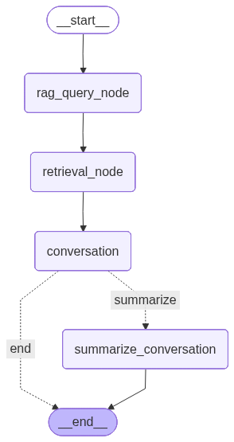
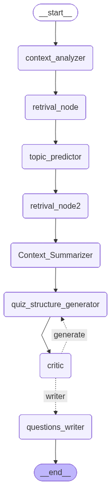
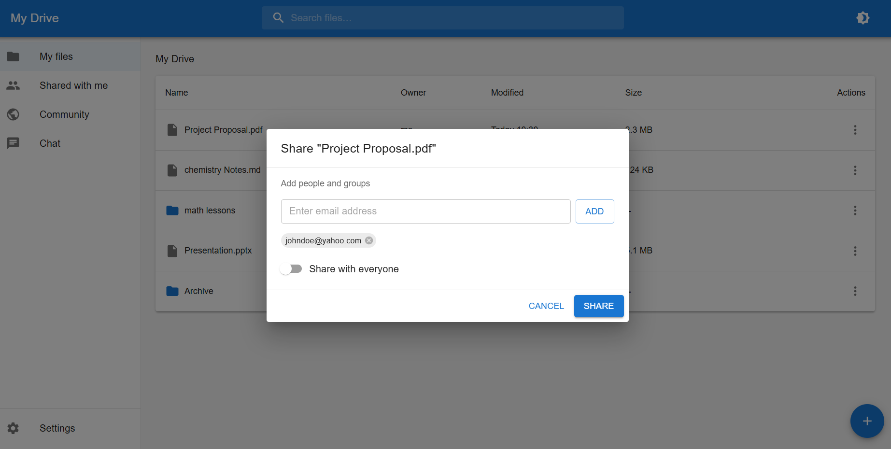
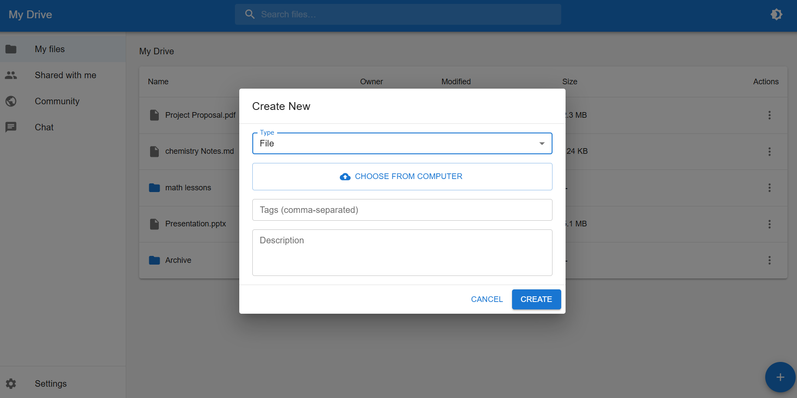
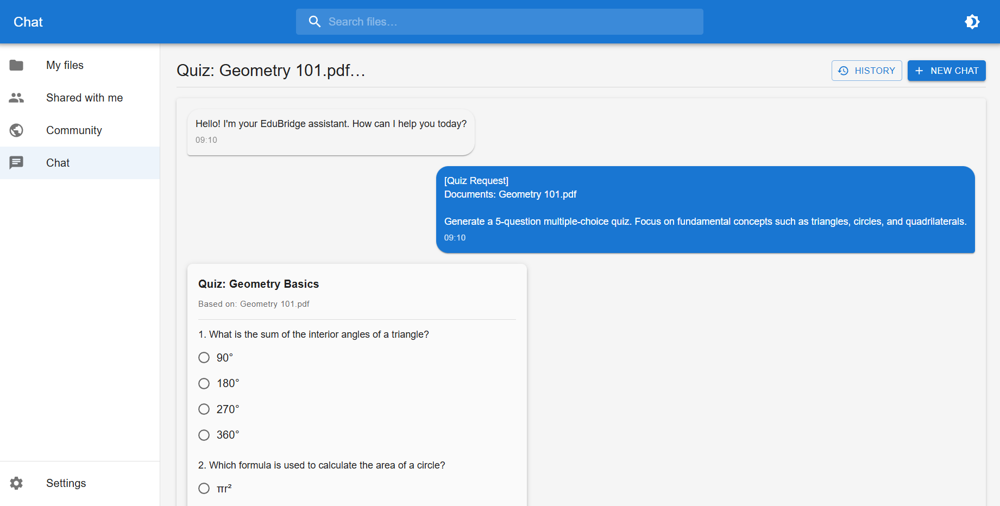
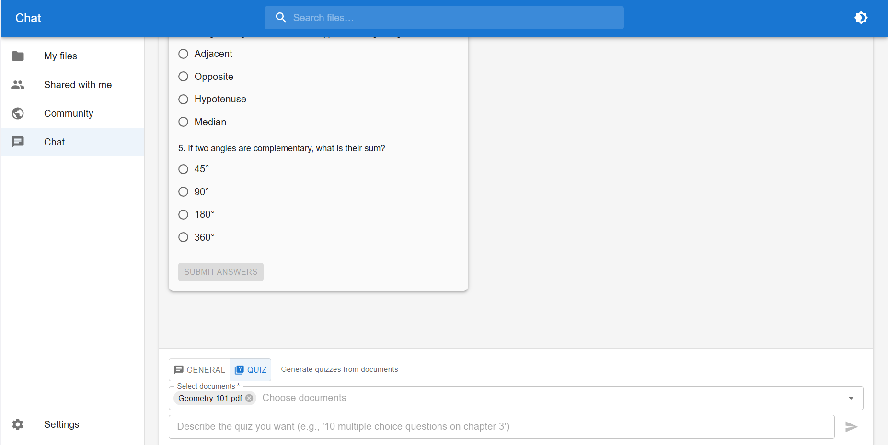

# eduBridge

> **Bridging knowledge between society through intelligent document sharing and AI-powered learning.**

eduBridge is an AI-powered educational platform designed to make educational content interactive, collaborative, and accessible. Users can upload documents, chat with them using Retrieval-Augmented Generation (RAG), generate tests automatically, and share knowledge across the community.

# Core Features

- Upload and manage educational documents

- Chat with documents using AI agents (RAG-based)

- Automatically generate quizzes & tests from documents

- Share documents with granular access control

- Community document publishing

- Secure authentication (Email + Google OAuth)

- Asynchronous AI processing with task tracking

- Object-level permission system with roles

# System Architecture

eduBridge follows a modern containerized architecture using Docker.

### Infrastructure

- **Docker & Docker Compose** for full environment orchestration

- **PostgreSQL** as primary database

- **Redis** as cache & Celery broker

- **Qdrant** as vector database

- **Azure Blob Storage** for document storage

- **Celery workers** for long-running tasks

# AI Stack

## LLMs

- **Gemma**

- **Gemini**

Used for:

- Conversational RAG

- Test generation

- Structured JSON outputs

## Workflow Orchestration

- **LangGraph**
  
  - Multi-step reasoning
  
  - Agent pipelines
  
  - Tool-based retrieval

## Document Parsing

- **LlamaParse**
  
  - Supports nearly all text-based formats
  
  - PDF, DOCX, TXT, and more
  
  - Structured extraction

## Vector Store

- **Qdrant**
  
  - Hybrid search
  
  - Semantic embeddings
  
  - Metadata filtering

# Authentication & Security

### Authentication Methods

- Email + Password

- Google OAuth

- Email verification required

### Security Features

- Email verification rate limiting

- Password reset rate limiting

- Object-level permissions with roles

- Access control per document

### Roles & Permissions

Object-level permissions allow:

- Owner

- Editor

- Viewer

Each document maintains granular access control rules.

# Database Schema

Below is the core schema powering eduBridge.

# Agents Workflow

eduBridge uses LangGraph-based multi-step agents.

## Document Processing Flow

1. User uploads document

2. File stored in Azure Blob Storage

3. LlamaParse extracts structured text

4. Text chunking

5. Embeddings generated

6. Stored in Qdrant

7. Document marked ready

## Chat (RAG) Flow

1. User asks question

2. Hybrid retrieval from Qdrant

3. Context passed to LLM

4. Structured grounded answer returned

5. Message persisted in database

## Test Generation Flow

1. Retrieve document context

2. Extract key concepts

3. Generate structured test JSON

4. Store and render dynamically in frontend

# Pages Overview

---

## My Files Page

Users can:

- Upload new documents

- Edit permissions

- Delete documents
  
  |  |  |
  | --------------------------------------------------------------------------------------------------------- | --------------------------------------------------------------------------------------------------------------- |
  |                                          |                                               |

---

## Shared With Me Page

Users can:

- Access documents shared by others

- Chat with shared content

- Generate tests

---

## Community Page

Users can:

- Publish documents publicly

- Browse community resources

- Interact with public educational material

---

## Chat Page

- Persistent chat sessions

- Context-aware responses

- Grounded answers using RAG

|  |  |
| ----------------------------------------------------------------- | ----------------------------------------------------------------- |

---

## Settings Page

Users can:

- change email

- Reset password

- See usage

---

# Testing

- Backend testing with **pytest**

- API-level validation

- Permission testing

- Agent workflow validation

---

# Tech Stack

## Frontend

- React

## Backend

- Django

- Django REST Framework

- PostgreSQL

## AI & Processing

- LangGraph

- Qdrant

- Gemma

- Gemini

- LlamaParse

## Async & Caching

- Celery

- Redis

## Storage

- Azure Blob Storage

## DevOps

- Docker

- Docker Compose
